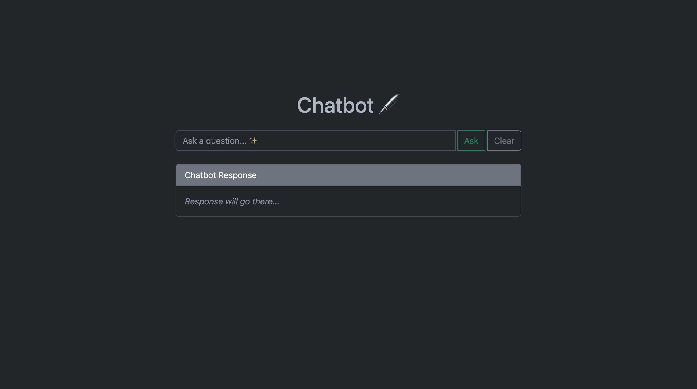

# Chatbot 🤖

This is a Ruby on Rails application that allows users to ask a question to a ChatBot using OpenAI API and see the response on the page.

## Installation

To install this application, follow these steps:

1. Clone this repository to your local machine:

   `git clone https://github.com/yourusername/your-repo.git`

2. Navigate into the project directory:

   `cd your-repo`

3. Install the necessary dependencies using bundler:

   `bundle install`

4. Add the API_TOKEN to the .envrc

5. Start the Rails server:

   `rails server`

6. Navigate to `http://localhost:3000` in your web browser to view the application.

7. Just ask the question...✨

## Usage

To use the application, follow these steps:

1. Navigate to `http://localhost:3000` in your web browser.
2. Enter a question in the text field and click the `Ask` button.
3. The response from the Chatbot will be displayed on the page.

## License

This project is licensed under the Apache 2.0 License. See the `LICENSE` file for details.
